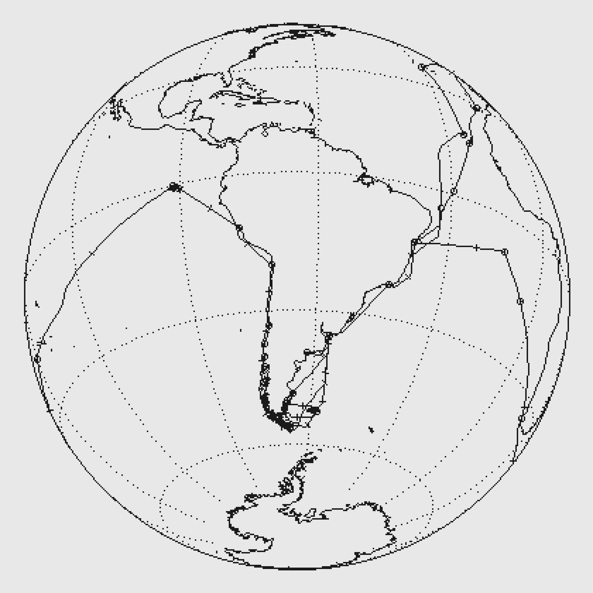

# DARWIN
## HMS BEAGLE  1831-1836

*1816 days · 42,360 nautical miles · 31% of it at anchor*

---

Inside the frame is a slice of open water about 55 metres deep, and a
boat sailing this track at one day per 24 real minutes. The plankton in the water are
not a decoration on the voyage — they are what the model works out *should*
be living in the water the ship is in, from the real temperature, mixed-layer
depth, nitrate and iron of that patch of ocean in that month.

Nothing in it was told where anything lives. Each organism carries a size, a
growth rate, a temperature it prefers and a defence against being eaten, and
the winners fall out. When it fills with diatom chains it is because the
model found that growing fast beats scavenging well when there is plenty to
scavenge; when it thins to a few ornate solitary things drifting in a haze,
that is a subtropical gyre, and it is supposed to look like that.

Press the button and it will show you the chart, and then a list of what is
currently in the water, with names.

---

### The track

139 dated positions, great-circle interpolated. It reaches 51°N
in the north and 56°S in the south. 78 of the positions are
reconstructed rather than recorded — mostly the long ocean crossings, where
nobody wrote anything down for weeks at a time.

Darwin towed a plankton net off the stern for much of the five years and
wrote about what came up in it, which makes this the one voyage where the
organisms in the frame are not a conceit.

THE PACIFIC CROSSING (days 1395-1450). Galapagos to Tahiti, three thousand
miles, and as with Drake the intermediate positions are a great-circle
construction rather than a record.

THE BRAZILIAN RE-CROSSING (day 1745). FitzRoy recrossed the Atlantic to
Bahia to re-check his chronometer readings, adding a month to a voyage
everyone aboard wanted finished. Darwin was furious about it and it is the
reason the track doubles back before going home.

RIO (days 100-191). Three months at anchor while Darwin worked ashore, which
is the longest the piece ever sits in one water mass.

---

### What is honestly wrong with it

The ocean is the ocean **as it is now**. There is no climatology for the
sixteenth century, so this is a modern ocean under an old track — and the
piece leans into that rather than pretending otherwise.

The organisms are drawn to be recognisable as their functional group, not
identifiable as their species, and they are nothing like to scale: a real
diatom at this magnification would be a fraction of one pixel. Treat the
frame as a plate from a monograph, which has always taken the same liberty.

---

*Sources: NOAA OISST, NOAA World Ocean Atlas 2023, Ifremer mixed-layer depth
climatology, Natural Earth. Trait parameters after Edwards et al. 2012, Ward
et al. 2012, Hansen et al. 1994, Marañón et al. 2013, Eppley 1972.*
