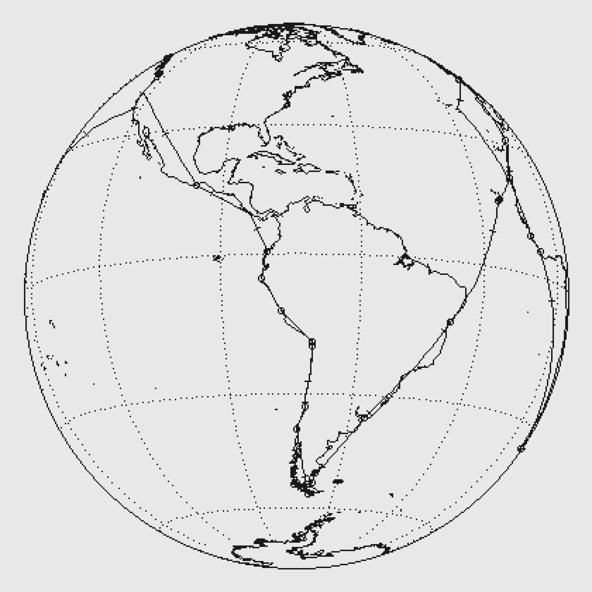

# DRAKE
## GOLDEN HIND  1577-1580

*1018 days · 35,789 nautical miles · 21% of it at anchor*

---

Inside the frame is a slice of open water about 55 metres deep, and a
boat sailing this track at one day per 24 real minutes. The plankton in the water are
not a decoration on the voyage — they are what the model works out *should*
be living in the water the ship is in, from the real temperature, mixed-layer
depth, nitrate and iron of that patch of ocean in that month.

Nothing in it was told where anything lives. Each organism carries a size, a
growth rate, a temperature it prefers and a defence against being eaten, and
the winners fall out. When it fills with diatom chains it is because the
model found that growing fast beats scavenging well when there is plenty to
scavenge; when it thins to a few ornate solitary things drifting in a haze,
that is a subtropical gyre, and it is supposed to look like that.

Press the button and it will show you the chart, and then a list of what is
currently in the water, with names.

---

### The track

62 dated positions, great-circle interpolated. It reaches 50°N
in the north and 56°S in the south. 7 of the positions are
reconstructed rather than recorded — mostly the long ocean crossings, where
nobody wrote anything down for weeks at a time.

Where the record is thin, and what this piece does about it.

SOUTHERNMOST (day 315).  Blown south after clearing the Strait, Drake
reached an island he named Elizabeth -- not the Elizabeth Island inside the
Strait, a different one, and one nobody has seen since.  Nuno da Silva's log
says 57 degrees S, at which latitude there is no land.  Modern scholarship
treats it as a phantom.  This track uses 55.85 S in the Hermite group, which
is conservative; whether Drake actually saw open water south of the
continent, and so discovered the passage that carries his name, is still
argued.  Turner says yes.  Kelsey says no.

CAPE ARAGO (day 539).  The furthest north Drake reached on the American
coast is disputed across four degrees of latitude.

NOVA ALBION (day 551).  Drakes Bay at Point Reyes is the designated
landmark and the mainstream reading.  It is not settled: the two surviving
manuscript accounts give 44 N against the printed 38 N, and there are twenty
or more candidate sites in the literature, from Baja to Alaska.

THE PACIFIC CROSSING (days 588-656).  Sixty-eight days out of sight of land
and not one intermediate position recorded anywhere.  The two waypoints in
the middle of it are a great-circle construction, nothing more.  They exist
so that the boat crosses the date line at a plausible latitude, and they are
tagged 0 accordingly.  The piece will spend nine weeks in the North Pacific
gyre on the strength of them, which is exactly the stretch where it will
look emptiest -- and correctly so.

---

### What is honestly wrong with it

The ocean is the ocean **as it is now**. There is no climatology for the
sixteenth century, so this is a modern ocean under an old track — and the
piece leans into that rather than pretending otherwise.

The organisms are drawn to be recognisable as their functional group, not
identifiable as their species, and they are nothing like to scale: a real
diatom at this magnification would be a fraction of one pixel. Treat the
frame as a plate from a monograph, which has always taken the same liberty.

---

*Sources: NOAA OISST, NOAA World Ocean Atlas 2023, Ifremer mixed-layer depth
climatology, Natural Earth. Trait parameters after Edwards et al. 2012, Ward
et al. 2012, Hansen et al. 1994, Marañón et al. 2013, Eppley 1972.*
